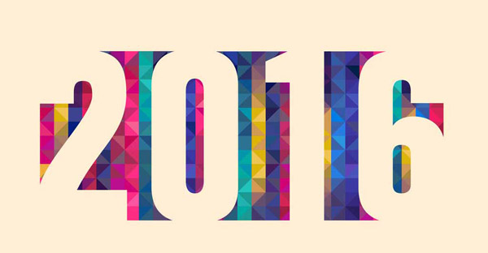

#前言
>逝者如斯夫，不舍昼夜

时光荏苒，今天已是2015最后一天，一年的时光进入最后的尾声，梦想呢？是不是离年初的规划更远了？今年也正好是我的本命年（两轮了），这一年可以说是平淡且踏实的，学到了很多也见到了更多，私以为自己在各方面都比上一年有所进步、提高。新一年来临之际，说说15年的那些事以及16年的计划吧。

#昨日之日不可留
2014年6月底来到北京，七月初入职（继续code生涯）直至今日，15年算是在北京完整度过的第一年。先说工作吧，来到北京的第一份工作到现在，很幸运的进入了这家公司，领导和同事对我都很好，公司氛围挺融洽的，认识了很多可爱的小伙伴儿，也学到了很多技术方面和工作上的知识。今年公司组织了撕名牌运动会和年终温泉滑雪趴也都是不亦乐乎。工作上除了公司分内的活我还接手了个公司内部的一个私活，微信端户外监测项目（更加深入了解了微信公众平台开发），自己独立开发就要从产品思考数据库设计到前后端实现及服务器端发布优化各方面都要关注，不过确实挺锻炼人。另外也参与了公司另外的一个声音摇一摇项目（有趣且有挑战的一个项目）。一路走来，从svn到git，从VS2010到VS2013到VS2015，公司技术和业务在发展，自己的水平也在提高，拥抱变化才能不断进步。共勉！

这一年生活上倒是平淡普通吧，刚来北京和几个陌生室友合租，虽然互相不认识不过大家人都挺好挺有礼貌的，由于和同学住得不远周末也经常一起吃饭或是去同学那蹭饭，挺开心。十月份后由于租房合同到期正好同学也要找房子然后就一起合租了，老同学在一起还是有很多话题的加上都是技术宅程序猿，好吧，不多说了都懂的。还有比较高兴的就是身边的同学一个个都找到人生的伴侣结婚生娃了，也是间接的提醒自己也老大不小了（放心，份子钱早晚要还回来的，I promise）。有情人终成家属，愿我们在尘世获得幸福。

#读书
这一年茶余饭后和闲暇之时还是没忘记阅读的，接下来分享一下这一年读的几本书吧。

技术相关类：

* [JavaScript高级层序设计](http://book.douban.com/subject/10546125/)
* [编程之美](http://book.douban.com/subject/3004255/)
* [C# in Depth](http://book.douban.com/subject/20490085/)
* [Node.js开发指南](http://book.douban.com/subject/10789820/)
* [Web全栈工程师的自我修养](http://book.douban.com/subject/26598045/)
* [人月神话](http://book.douban.com/subject/1102259/)
* [黑客与画家](http://book.douban.com/subject/6021440/)
* [MacTalk 跨越边界](http://book.douban.com/subject/26663519/)

文学小说和杂文类：

* [平凡的世界](http://book.douban.com/subject/1084165/)
* [围城](http://book.douban.com/subject/1008145/)
* [我所理解的生活](http://book.douban.com/subject/20425053/)
* [乖，摸摸头](http://book.douban.com/subject/25984204/)

财富类：

* [富爸爸财务自由之路](http://book.douban.com/subject/1007510/)
* [MBA教不了的创富课](http://book.douban.com/subject/5921213/)

#新年计划

1. 驾照（该科三了，拖两年了再不考就到期啦）
2. 造轮子，提升技术，再学习一门编程语言
3. 读完自己目前的Reading list
4. 坚持写博客，坚持发布个人公众号
5. 多抽出时间陪家人和朋友
6. 女朋友！女朋友！女朋友！（重要的事情说三遍）

#结束语
人生是一场修行，至死之前我们都是需要发育的孩子，编程亦是一个终身学习的过程。借以乔帮主的名言互勉之：
>Stay Hungry,Stay Foolish。

最后，祝愿大家新的一年心想事成，完成自己的目标，也希望自己新的一年能够知行合一，光彩依旧，斗志昂然。
